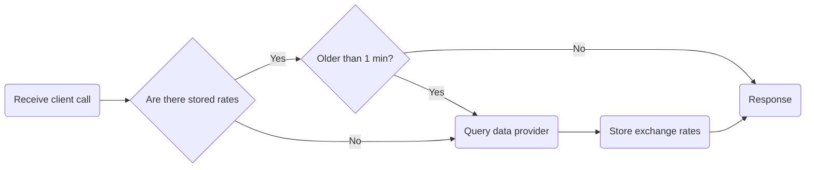

# Rho Interview Challenge

# How to run 

```bash
docker compose up --build
```

> **ATTENTION**
> In order to interact with the data provider API you need an **api key**. Also, there are **environment variable that need to be set**. This can be done by creating a `.env` file in the same directory of the `docker-compose.yml`

The `.env` file **needs** to contains these variables:
```bash
EXCHANGE_RATE_KEY=<data-provider-api-key>
CACHE_DURATION=60

LIMIT_FOR_PERIOD=5
LIMIT_REFRESH_PERIOD=60
TIMEOUT_DURATION=60
```

# Design process

## General requirements

- [x] Get exchange from A to B
- [x] Get exchange from A to B..Z
- [x] Get value from A to B
- [x] Get value from A to list of provided currencies
- [x] Auto documentation with Swagger
- [x] Support for GraphQL
- [x] Implement rate limiting
- [x] Dockerize
- [ ] Implement authentication/authorization
- [ ] Unit testing
- [ ] Remove TESTING blocks (mainly because I exceeded the montly API calls to the provider hahaha)

Data providers to use:
- [exchangerate.host](https://exchangerate.host)

### Important notes

> *"make as few calls as possible"*

We can **use "two-step conversion"** for exchanges by query only for the rates of exchange for currency X to all other currency and then use it as a conversion map. **This way we can only query for complete list of rates and only when data is obsolete.**

> #### Example:
>
> - If we are first queried for the rate between A and B, we can request the provider for all the rates of A, and if we are then queried for X to Z, we can just use the existing locally stored rates (if not obsolete) and calculate X to A and A to Z.
> - **Exchange rate of A to B = (A to X) * (X to B)**

## API interaction flowchart

Minimal steps approach, while making as few calls to data provider as possible.



## API endpoints
- `/rate/A` - Get exchange rates for currency A
- `/rate/A?currency=B` - Get exchange rate from currency A to B
- `/rate/A?c=B&c=C&c=D` - Get exchange rate from currency A to B, C and D
- `/value/A?c=B&v=3.0` - Get A value in B currency
- `/value/A?c=B&c=C&c=D&v=3.0` - Get A value in B, C and D currency

- `/swagger-ui/index.html` - API Swagger Docs

## Data provider

### Response format

For this request: `https://api.exchangerate.host/live?access_key=<api_key>`

We get the following response

```json
{
 "success": true,
 "terms": "https:\/\/currencylayer.com\/terms",
 "privacy": "https:\/\/currencylayer.com\/privacy",
 "timestamp": 1740477123,
 "source": "USD",
 "quotes": {
  "USDAED": 3.672745,
  "USDAFN": 73.978873,
  ...
 }
}
```