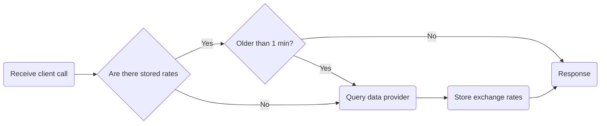

# Rho Interview Challenge

# How to run 

# Initial analysis

## General requirements

- [x] Get exchange from A to B
- [x] Get exchange from A to B..Z
- [x] Get value from A to B
- [x] Get value from A to list of provided currencies
- [x] Auto documentation with Swagger
- [x] Support for GraphQL
- [x] Implement rate limiting
- [x] Dockerize
- [ ] Implement authentication/authorization
- [ ] Unit testing
- [ ] Remove TESTING blocks (mainly because I exceeded the montly API calls to the provider hahaha)

Data providers to use:
- [exchangerate.host](https://exchangerate.host)

### Important notes

> *"make as few calls as possible"*

We can **use "two-step conversion"** for exchanges by query only for the rates of exchange for currency X to all other currency and then use it as a conversion map. **This way we can only query for complete list of rates and only when data is obsolete.**

> #### Example:
>
> - If we are first queried for the rate between A and B, we can request the provider for all the rates of A, and if we are then queried for X to Z, we can just use the existing locally stored rates (if not obsolete) and calculate X to A and A to Z.
> - **Exchange rate of A to B = (A to X) * (X to B)**

## API interaction flowchart

Minimal steps approach, while making as few calls to data provider as possible.



## API endpoints
- `/rate/A` - Get exchange rates for currency A
- `/rate/A?currency=B` - Get exchange rate from currency A to B
- `/rate/A?c=B&c=C&c=D` - Get exchange rate from currency A to B, C and D
- `/value/A?c=B&v=3.0` - Get A value in B currency
- `/value/A?c=B&c=C&c=D&v=3.0` - Get A value in B, C and D currency

- `/swagger-ui/index.html` - API Swagger Docs

# Data provider response format

For this request: `https://api.exchangerate.host/live?access_key=<api_key>`

We get the following response

```json
{
 "success": true,
 "terms": "https:\/\/currencylayer.com\/terms",
 "privacy": "https:\/\/currencylayer.com\/privacy",
 "timestamp": 1740477123,
 "source": "USD",
 "quotes": {
  "USDAED": 3.672745,
  "USDAFN": 73.978873,
  "USDALL": 94.694346,
  "USDAMD": 394.16163,
  "USDANG": 1.802824,
  "USDAOA": 917.000255,
  "USDARS": 1060.13009,
  "USDAUD": 1.578843,
  "USDAWG": 1.8025,
  "USDAZN": 1.697786,
  "USDBAM": 1.868852,
  "USDBBD": 2.019732,
  "USDBDT": 121.535558,
  "USDBGN": 1.86794,
  "USDBHD": 0.376912,
  "USDBIF": 2962.594898,
  "USDBMD": 1,
  "USDBND": 1.338442,
  "USDBOB": 6.926734,
  "USDBRL": 5.820033,
  "USDBSD": 1.000358,
  "USDBTC": 1.1280895e-5,
  "USDBTN": 86.702181,
  "USDBWP": 13.778935,
  "USDBYN": 3.273596,
  "USDBYR": 19600,
  "USDBZD": 2.009317,
  "USDCAD": 1.42646,
  "USDCDF": 2872.000333,
  "USDCHF": 0.896565,
  "USDCLF": 0.024595,
  "USDCLP": 943.829732,
  "USDCNY": 7.2481,
  "USDCNH": 7.267505,
  "USDCOP": 4117.75,
  "USDCRC": 506.533528,
  "USDCUC": 1,
  "USDCUP": 26.5,
  "USDCVE": 105.362987,
  "USDCZK": 23.846028,
  "USDDJF": 178.132391,
  "USDDKK": 7.12478,
  "USDDOP": 62.196316,
  "USDDZD": 134.83248,
  "USDEGP": 50.601303,
  "USDERN": 15,
  "USDETB": 129.083586,
  "USDEUR": 0.955115,
  "USDFJD": 2.298402,
  "USDFKP": 0.791194,
  "USDGBP": 0.79222,
  "USDGEL": 2.815003,
  "USDGGP": 0.791194,
  "USDGHS": 15.504646,
  "USDGIP": 0.791194,
  "USDGMD": 71.501257,
  "USDGNF": 8649.661018,
  "USDGTQ": 7.72079,
  "USDGYD": 209.283104,
  "USDHKD": 7.773295,
  "USDHNL": 25.572251,
  "USDHRK": 7.193801,
  "USDHTG": 131.216466,
  "USDHUF": 382.683006,
  "USDIDR": 16358,
  "USDILS": 3.588545,
  "USDIMP": 0.791194,
  "USDINR": 87.1939,
  "USDIQD": 1310.275641,
  "USDIRR": 42112.5023,
  "USDISK": 138.789667,
  "USDJEP": 0.791194,
  "USDJMD": 157.760206,
  "USDJOD": 0.709501,
  "USDJPY": 149.660498,
  "USDKES": 129.349649,
  "USDKGS": 87.450415,
  "USDKHR": 4003.764877,
  "USDKMF": 469.625022,
  "USDKPW": 899.984885,
  "USDKRW": 1433.839805,
  "USDKWD": 0.30854,
  "USDKYD": 0.833516,
  "USDKZT": 500.176754,
  "USDLAK": 21714.722534,
  "USDLBP": 89627.863644,
  "USDLKR": 295.695791,
  "USDLRD": 199.565228,
  "USDLSL": 18.354841,
  "USDLTL": 2.95274,
  "USDLVL": 0.60489,
  "USDLYD": 4.896204,
  "USDMAD": 9.963737,
  "USDMDL": 18.631184,
  "USDMGA": 4730.895105,
  "USDMKD": 58.747154,
  "USDMMK": 2099.112905,
  "USDMNT": 3465.409824,
  "USDMOP": 8.008981,
  "USDMRU": 39.782136,
  "USDMUR": 46.43009,
  "USDMVR": 15.350316,
  "USDMWK": 1734.502281,
  "USDMXN": 20.48645,
  "USDMYR": 4.422501,
  "USDMZN": 63.910171,
  "USDNAD": 18.352649,
  "USDNGN": 1499.519527,
  "USDNIO": 36.807881,
  "USDNOK": 11.126585,
  "USDNPR": 138.723872,
  "USDNZD": 1.74931,
  "USDOMR": 0.385004,
  "USDPAB": 1.000358,
  "USDPEN": 3.68276,
  "USDPGK": 4.084987,
  "USDPHP": 57.945504,
  "USDPKR": 280.03698,
  "USDPLN": 3.94785,
  "USDPYG": 7900.432383,
  "USDQAR": 3.649507,
  "USDRON": 4.754097,
  "USDRSD": 111.914978,
  "USDRUB": 86.249612,
  "USDRWF": 1416.401902,
  "USDSAR": 3.750036,
  "USDSBD": 8.439997,
  "USDSCR": 14.423531,
  "USDSDG": 600.999659,
  "USDSEK": 10.64522,
  "USDSGD": 1.339825,
  "USDSHP": 0.794626,
  "USDSLE": 22.940144,
  "USDSLL": 20969.505638,
  "USDSOS": 571.701584,
  "USDSRD": 35.451498,
  "USDSTD": 20697.981008,
  "USDSVC": 8.751732,
  "USDSYP": 13001.950046,
  "USDSZL": 18.358854,
  "USDTHB": 33.714021,
  "USDTJS": 10.902116,
  "USDTMT": 3.51,
  "USDTND": 3.176131,
  "USDTOP": 2.342096,
  "USDTRY": 36.463255,
  "USDTTD": 6.792146,
  "USDTWD": 32.794498,
  "USDTZS": 2592.501004,
  "USDUAH": 41.778266,
  "USDUGX": 3676.930795,
  "USDUYU": 43.152337,
  "USDUZS": 12902.116276,
  "USDVES": 63.414134,
  "USDVND": 25520,
  "USDVUV": 121.998402,
  "USDWST": 2.815878,
  "USDXAF": 626.795347,
  "USDXAG": 0.031058,
  "USDXAU": 0.00034,
  "USDXCD": 2.70255,
  "USDXDR": 0.76195,
  "USDXOF": 626.795347,
  "USDXPF": 113.94449,
  "USDYER": 247.375017,
  "USDZAR": 18.40459,
  "USDZMK": 9001.197922,
  "USDZMW": 28.233439,
  "USDZWL": 321.999592
 }
}
```