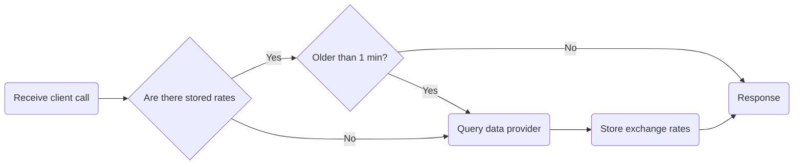

# rho-interview-challenge

## General requirements
1. Get exchange from A to B
2. Get exchange from A to B..Z
3. Get value from A to B
4. Get value from A to list of provided currencies
5. Auto documentation with Swagger
7. Support in REST and GraphQL
8. Implement rate limiting

Data providers to use:
- [Fixer](https://fixer.io/)
- [exchangerate.host](https://exchangerate.host)

## Flowchart

Minimal steps approach, while making as few calls to data provider as possible.

## API to API commms

> *"make as few calls as possible"*

**Use "two-step conversion"**. Query only for the rates of exchange for currency X to all other currency:
- e.g: A to B, can be A to X to B
- **Exchange rate of A to B = (A to X) * (X to B)**

## API endpoints
- `/rate/ID` - Get exchange rates for currency A
- `/rate/A?currency=B` - Get exchange rate from currency A to B
- `/rate/A?c=B&c=C&c=D` - Get exchange rate from currency A to B, C and D
- `/value/A?c=B&v=3.0` - Get A value in B currency
- `/value/A?c=B&c=C&c=D&v=3.0` - Get A value in B, C and D currency