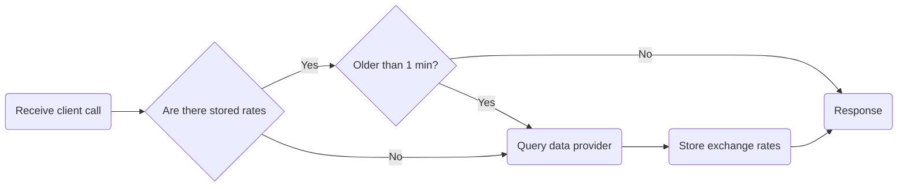

# Rho Interview Challenge

# How to run 

# Initial analysis

## General requirements

1. Get exchange from A to B
2. Get exchange from A to B..Z
3. Get value from A to B
4. Get value from A to list of provided currencies
5. Auto documentation with Swagger
7. Support in REST and GraphQL
8. Implement rate limiting

Data providers to use:
- [Fixer](https://fixer.io/)
- [exchangerate.host](https://exchangerate.host)

### Important notes

> *"make as few calls as possible"*

We can **use "two-step conversion"** for exchanges by query only for the rates of exchange for currency X to all other currency and then use it as a conversion map. **This way we can only query for complete list of rates and only when data is obsolete.**

> #### Example:
>
> - If we are first queried for the rate between A and B, we can request the provider for all the rates of A, and if we are then queried for X to Z, we can just use the existing locally stored rates (if not obsolete) and calculate X to A and A to Z.
> - **Exchange rate of A to B = (A to X) * (X to B)**

## API interaction flowchart

Minimal steps approach, while making as few calls to data provider as possible.

## API endpoints
- `/rate/A` - Get exchange rates for currency A
- `/rate/A?currency=B` - Get exchange rate from currency A to B
- `/rate/A?c=B&c=C&c=D` - Get exchange rate from currency A to B, C and D
- `/value/A?c=B&v=3.0` - Get A value in B currency
- `/value/A?c=B&c=C&c=D&v=3.0` - Get A value in B, C and D currency